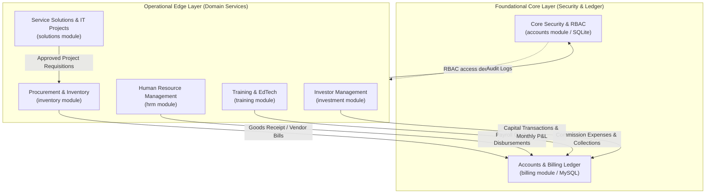
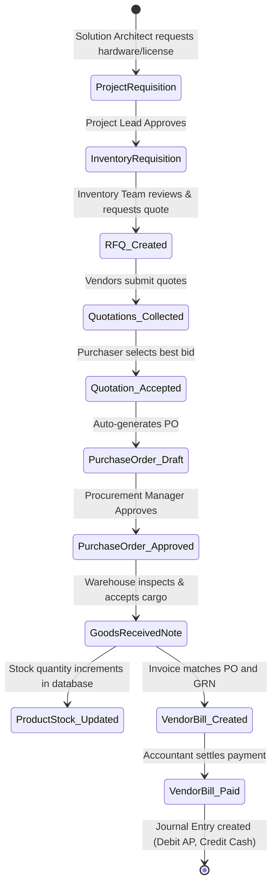
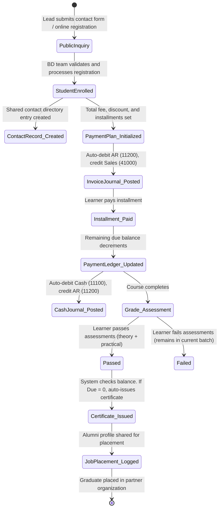
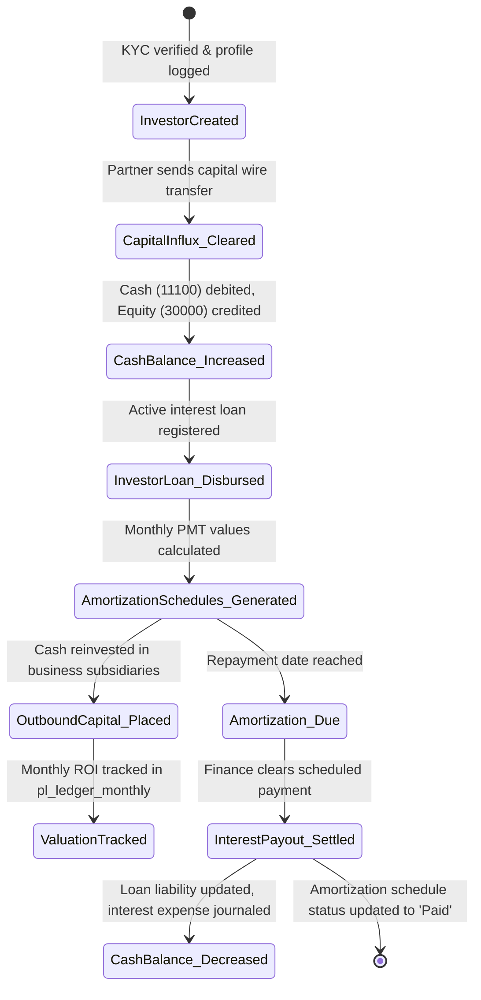

# ERP System Architecture & Module Blueprint

This document serves as the central systems reference and architectural blueprint for the unified Intrex ERP/CRM platform. It outlines high-level topologies, data integration paths, lifecycle workflows, and planned extension points for development teams.

---

## Phase 1: High-Level Module Topology

The system is designed with a layered service model. The foundational **Core** layer handles authentication, session tracking, auditing, and financial ledger persistence. The **Operational Edge** modules run specific business domains (HRM, EdTech, Procurement, Projects, Investments) and feed financial metrics and audits back into the Core.



### Module Boundary Inputs & Outputs

| Module | Primary Input Boundary | Primary Output Boundary |
| :--- | :--- | :--- |
| **User Management & Security** | User login credentials, HTTP request metadata, authorization check queries. | Active user sessions, decorator-enforced permissions (`@module_access`), cryptographically chain-hashed audit logs. |
| **Accounts & Billing** | General journal entries, tax configurations, receivables payment records, vendor bills. | Chart of Accounts (COA), real-time financial statements (Trial Balance, P&L, Balance Sheet), transaction ledger. |
| **Human Resource Management (HRM)** | Candidate resumes, shift rosters, daily entry/exit attendance logs, leaves, salary structure inputs. | Active employee profiles (linked to Contacts), payroll sheets, disbursed journal entries (Payroll Expense debits). |
| **Procurement & Inventory** | Material/service requisitions, vendor specifications, RFQ deadlines, quotations, deliveries. | Purchase Orders (POs), stock ledger increments (Goods Receipts), decrementing delivery notes, vendor bill triggers. |
| **IT Projects & Solutions** | Project scoping, milestones, task listings, team allocations, IT project requisitions. | Task boards, stakeholder registers, license assets, purchase requisition pipeline triggers. |
| **Training & EdTech** | Online inquiries, course enrollments, batch assignments, assessments (grades), installment receipts. | Verifiable student certificates (balance = 0 + pass grade), placement logs, BD/ambassador commission listings. |
| **Investor Management** | Investor KYC verification, capital influx bank wires, loan agreements, outbound investments. | Influx transactions, amortization payment schedules, interest payout cash-flow, outbound equity valuations. |

---

## Phase 2: Master Data Flow & Event Map

The integration web below illustrates the transactional database events and state transitions crossing module boundaries.

```mermaid
flowchart TD
    %% Define Styles
    classDef core fill:#e1f5fe,stroke:#0288d1,stroke-width:2px;
    classDef edge fill:#efebe9,stroke:#5d4037,stroke-width:2px;
    classDef shared fill:#e8f5e9,stroke:#2e7d32,stroke-width:2px;

    %% Subgraphs for Modules
    subgraph CoreSec ["Core Security & RBAC"]
        AuthDb[(SQLite: auth_user)]
        AuditLog[(SQLite: accounts_auditlog)]
        ActiveSess[(SQLite: accounts_activesession)]
    end

    subgraph CoreBilling ["Accounts & Billing ('billing')"]
        COA[(MySQL: chart_of_accounts)]
        JE[(MySQL: journal_entries)]
        Invoices[(MySQL: invoices)]
        Bills[(MySQL: vendor_bills)]
        PayRecs[(MySQL: payments)]
    end

    subgraph SolMod ["IT Projects & Solutions ('solutions')"]
        Projects[(MySQL: projects)]
        ProjTasks[(MySQL: project_tasks)]
        ProjReqs[(MySQL: project_requisitions)]
        Licenses[(MySQL: software_licenses)]
    end

    subgraph InvMod ["Procurement & Inventory ('inventory')"]
        Reqs[(MySQL: requisitions)]
        RFQs[(MySQL: rfqs)]
        Quotes[(MySQL: quotations)]
        POs[(MySQL: purchase_orders)]
        GRNs[(MySQL: goods_receipts)]
        Products[(MySQL: products)]
        InvLedger[(MySQL: inventory_ledger)]
        Vendors[(MySQL: vendors)]
        Deliveries[(MySQL: deliveries)]
    end

    subgraph HRMMod ["Human Resource Management ('hrm')"]
        Employees[(MySQL: employees)]
        Attendance[(MySQL: hrm_attendance)]
        Leaves[(MySQL: hrm_leaves)]
        Payrolls[(MySQL: hrm_payrolls)]
        Advances[(MySQL: hrm_advances)]
        Claims[(MySQL: hrm_expense_claims)]
        Assets[(MySQL: hrm_assets)]
    end

    subgraph TrainMod ["Training & EdTech ('training')"]
        Courses[(MySQL: learn_courses)]
        Batches[(MySQL: learn_batches)]
        StudentRegs[(MySQL: learn_registrations)]
        TrainPayments[(MySQL: learn_payments)]
        Assessments[(MySQL: learn_course_assessments)]
        Certificates[(MySQL: learn_certificates)]
        Inquiries[(MySQL: learn_online_inquiries)]
    end

    subgraph InvestMod ["Investor Management ('investment')"]
        Investors[(MySQL: investors)]
        InvTx[(MySQL: investment_transactions)]
        Loans[(MySQL: investor_loans)]
        Amort[(MySQL: loan_amortization_schedules)]
        Outbound[(MySQL: outbound_investments)]
    end

    subgraph MasterEntities ["Shared Master Entity Directory"]
        ContactsMaster[(MySQL: contacts)]
    end

    %% Flows
    %% Shared Master Connections
    Employees -->|Onboarding: Initialize Contact| ContactsMaster
    StudentRegs -->|Enrollment: Initialize Contact| ContactsMaster
    Investors -->|KYC Clear: Initialize Contact| ContactsMaster

    %% HRM to Accounts/Security
    Payrolls -->|Disburse payroll: debit expense, credit cash| JE
    Employees -->|Asset allocation| Assets
    
    %% Training flows
    Inquiries -->|Convert Inquiry| StudentRegs
    StudentRegs -->|Init financial state| TrainPayments
    TrainPayments -->|Automated payment posting: Dr Cash, Cr AR| JE
    TrainPayments -->|Trigger certificate: Balance = 0| Certificates
    Assessments -->|Grade Check: Passed| Certificates

    %% Solutions to Inventory
    ProjReqs -->|Approved Project Requisition| Reqs

    %% Inventory flows
    Reqs -->|Create RFQ| RFQs
    RFQs -->|Collect Vendor Quotes| Quotes
    Quotes -->|Quotation Accepted| POs
    POs -->|Approve PO| Bills
    POs -->|Inspection & Stock Increase| GRNs
    GRNs -->|GRN Audit Log| InvLedger
    GRNs -->|Increase Warehouse stock| Products
    GRNs -->|Invoice Match & Trigger AP Bill| Bills
    Reqs -->|Dispatch Client Handover| Deliveries
    Deliveries -->|Decrement Stock Ledger| InvLedger
    Deliveries -->|Mark Requisition completed| Reqs
    Deliveries -->|Update warehouse qty| Products

    %% Inventory to Billing
    Bills -->|Settlement Payment: Dr AP, Cr Cash| JE
    
    %% Investment flows
    InvTx -->|Capital Influx: Dr Cash, Cr Capital| JE
    Loans -->|Generate PMT schedule| Amort
    Amort -->|Clear payable schedule| InvTx
    InvTx -->|Interest Payout: Dr Interest Exp, Cr Cash| JE

    %% Style applications
    class AuthDb,AuditLog,ActiveSess core;
    class COA,JE,Invoices,Bills,PayRecs core;
    class ContactsMaster shared;
    class Projects,ProjTasks,ProjReqs,Licenses edge;
    class Reqs,RFQs,Quotes,POs,GRNs,Products,InvLedger,Vendors,Deliveries edge;
    class Employees,Attendance,Leaves,Payrolls,Advances,Claims,Assets edge;
    class Courses,Batches,StudentRegs,TrainPayments,Assessments,Certificates,Inquiries edge;
    class Investors,InvTx,Loans,Amort,Outbound edge;
```



### Key Integration Points
1. **Automated Subledger Postings:** Collections on student installments (`learn_payments`) and payouts on payroll disbursements (`hrm_payrolls`) publish events directly to the General Ledger (`journal_entries`), auto-resolved to Chart of Accounts (COA) codes (e.g., `11100` Cash, `11200` AR, `51000` payroll/general expense).
2. **Project Material Pipeline:** Project-scoped requisitions (`project_requisitions`) automatically populate the inventory `requisitions` queue. This triggers standard RFQ/Quotation processes.
3. **Master Directory Linkage:** General contacts (`contacts`) are tracked under a single MySQL table containing a role list. Operational details (banking, courses, portfolios) are maintained inside module tables, but refer to this contact database via a unique `contact_id`.

---

## Phase 4: Global State Machines & Lifecycle Workflows

### 1. Procure-to-Pay (P2P) Lifecycle

This workflow handles IT project specifications through procurement and final payment settlements.



---

### 2. Lead-to-Cash (EdTech Training) Lifecycle

This lifecycle tracks prospective learners from public inquiries through training, financial clearance, certification, and career placement.



---

### 3. Capital Lifecycle (Inbound, Amortization, Outbound)

Tracks the influx of capital from partners, the accrual and settlement of interest liability, and reinvestments.



---

## Phase 5: Extension Points & Hook Planning

To allow engineers to scale the ERP application without introducing coupling dependencies or breaking core financial ledger checks, we propose the following hook points:

### 1. Django Signal & Task Triggers
MySQL is the primary data store for business operations. Django signals and background tasks (Celery/Django-Q) can intercept write operations asynchronously:
- **`post_save` on `StudentPayment`:** Triggers certificate validation pipelines. When `due_amount <= 0`, queries `CourseAssessment` to verify passed grades, and creates a `Certificate` record.
- **`post_save` on `Requisition`:** Sends real-time slack notifications to the procurement channel whenever new approved project requisitions are added.
- **`post_save` on `GoodsReceipt`:** Dispatches automatic inventory valuations to the accounting sub-ledger.

### 2. Django signals (SQLite Context)
For local authentication and security modules, Django signals intercept lifecycle actions:
- **`user_logged_in` / `user_logged_out`:** Logs audit entries in SQLite and terminates active sessions on remote devices.
- **`pre_delete` on `AuditLog`:** Enforces system immutability. Attempts to delete audit log entries automatically raise a `PermissionDenied` exception.

### 3. Webhook Dispatcher Engine
We recommend building a central Webhook registration model (`Webhook`) in Django:
```json
{
  "event_type": "PO_FULFILLED",
  "target_url": "https://api.intrex-projects.com/v1/shipments",
  "secret_token": "sha256_signing_key_here"
}
```
Whenever a Purchase Order changes state to `Fulfilled`, a helper utility sends a signed POST payload to external endpoints, allowing client-facing portals to synchronize status changes.