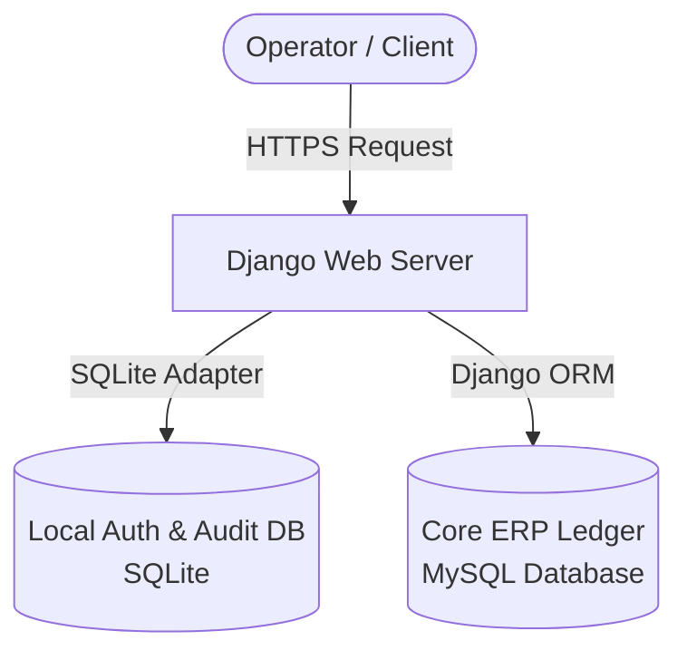

# Welcome to the Intrex ERP Documentation Portal

Welcome to the internal documentation and runbook registry for the **Intrex Digital Unified ERP & CRM Platform**. This documentation acts as the single source of truth for operators, system administrators, and application developers.

---

## Documentation Categories

Select a section below to get started:

### 📖 End-User Hub

For module operators, academic coordinators, HR officers, and accountants.

*   [Getting Started Guide](user-guides/getting-started.md): Interface overview, basic navigation, and account login.
*   [HR Management Runbook](user-guides/hrm.md): Managing shift rosters, clock-in approvals, leaves, and payroll logs.
*   [Inventory & Procurement](user-guides/inventory.md): Generating requisitions, compiling vendor bids, issuing purchase orders, and recording GRNs.
*   [Accounts & Billing](user-guides/billing.md): Operating the general ledger, double-entry journals, invoices, and printing financial statements.
*   [Service Solutions](user-guides/solutions.md): Coordinating client bid proposals, managing development tasks on the Kanban board, and tracking client licensing assets.
*   [Training & EdTech](user-guides/training.md): Administering course and batch schedules, processing student tuition installments, grading assessments, and issuing verified certificates.

### ⚙️ SysAdmin Runbooks

For server administrators, security auditors, and database compliance teams.

*   [Access Control (RBAC)](admin-runbooks/access-control.md): Configuring roles, Django user group permissions, and active session revocations.
*   [Audit & Compliance](admin-runbooks/audit-compliance.md): Reviewing cryptographic logs, checking hash integrity, and diagnosing security anomalies.
*   [Disaster Recovery](admin-runbooks/disaster-recovery.md): Handling daily MySQL backups, database restorations, and key replacement.
*   [System Configuration](admin-runbooks/system-config.md): Global environment parameters, secret keys, and database connections.
*   [Modules & Sections](admin-runbooks/modules-sections.md): Layout catalog of all application pages and corresponding permissions scopes.

### 🛠️ Developer Blueprint

For engineering staff extending business logic, writing custom scripts, or deploying instances.

*   [Architecture & Logic](developer/architecture.md): Module topology, event flows, state machine lifecycles, and code hook triggers.
*   [Database Schema](developer/database-schema.md): MySQL relational schema, SQLite system schemas, and entity-relationship models.
*   [API Reference](developer/api-reference.md): Public JSON endpoints for web inquiries, registrations, and internal query parameters.
*   [Local Setup Guide](developer/local-setup.md): Cloning repositories, virtual environments, configuration files, and running unit tests.

---

## System Overview & Architecture

The Intrex ERP platform uses a **hybrid database model** designed to balance security compliance with scalability requirements:

*   **SQLite3 Database (`db.sqlite3`)**: Runs locally on the app node. Restricts authentication checks, active sessions, and logs to an isolated local file. This keeps core access logs lightweight and immune to database latency.
*   **MySQL Database**: Hosts all multi-tenant operational data (such as project scoping, training classes, invoice receipts, and employee records).