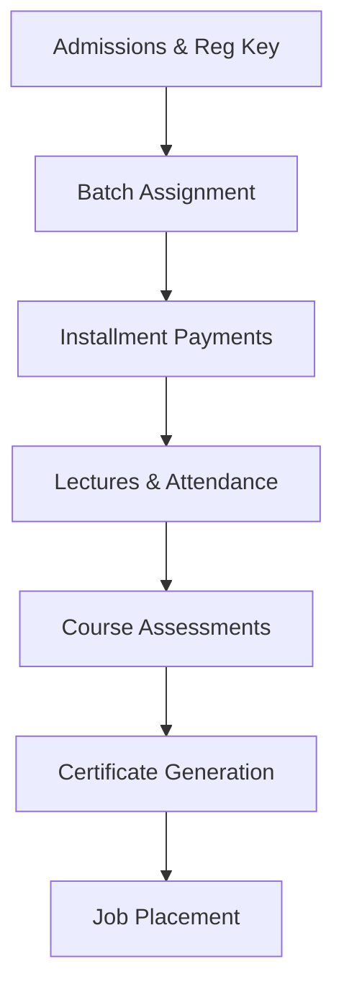

# Training & EdTech Guide

The Training & EdTech module coordinates academic activities, covering course configurations, student admissions, batch scheduling, payment installments, assessments, certificates, and the Brand Ambassadors referral network.

---

## 1. Academic Lifecycle

The academic flow manages the student journey from registration to placement:

---

## 2. Course & Batch Setup

### A. Creating a Course
1. Navigate to **Training** -> **Course Setup**.
2. Click **Create Course**.
3. Input the title (e.g. CompTIA Security+), code (e.g. `SEC`), course duration, fee, and syllabus.
4. Set status to **Active** to expose it on the corporate site's registration forms.

### B. Scheduling Batches
1. Navigate to **Training** -> **Batch Management**.
2. Click **Create Batch**.
3. Link the batch to a course, select assigned trainers, set the class calendar days, and allocate maximum seat capacity.

---

## 3. Student Admissions & Installments

### A. Processing Admissions
1. Navigate to **Training** -> **Student List**.
2. To process a public application, search the **Inquiries** tab for their registration key (e.g. `REG-104958`).
3. Click **Enroll Candidate**.
4. Set the student status to **Active**, assign them to a scheduled batch, and define their payment structure.

### B. Managing Installment Plans
1. On the student's profile page, click **Installment Plan**.
2. Divide the tuition fee into custom payments (e.g. 3 monthly installments).
3. As payments are received, locate the student record in the **Installment Tracker**, click **Record Payment**, and enter the cash/bank details. This posts a corresponding credit to EdTech Tuition Revenue in the general ledger.

---

## 4. Assessments, Certificates & Placement

### A. Assessments & Grading
1. Go to **Training** -> **Assessments**.
2. Select the target batch and assessment type (Quiz, Midterm, Final Exam).
3. Input student marks. The system computes average GPA scores.

### B. Issuing Certificates
1. When a student passes all requirements, navigate to **Training** -> **Certificates**.
2. Select the student and click **Issue Certificate**.
3. The system generates a certificate record in MySQL with a unique key prefixed with `INTREX-CERT-`.
4. Graduated students can show employers this key, which can be verified at `/verify-certificate/`.

### C. Job Placement
*   Log graduate CVs in **Job Placement**.
*   Match candidate skills with requirements submitted by partner corporate employers.

---

## 5. Brand Ambassadors (Referral Network)

To scale admissions, the system features a **Brand Ambassadors** portal:
1. Navigate to **Training** -> **Brand Ambassadors**.
2. Register an ambassador (typically existing students or partners) to generate their referral credentials.
3. **Commission Tracking**: When a referred student completes enrollment, log the referral. The system automatically computes commission pay-outs and updates the general ledger logs.